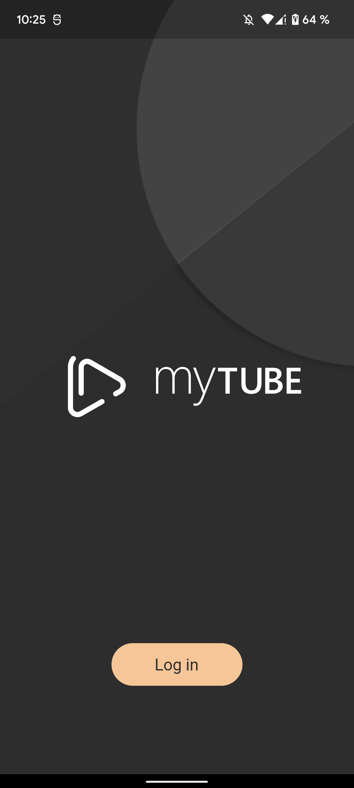
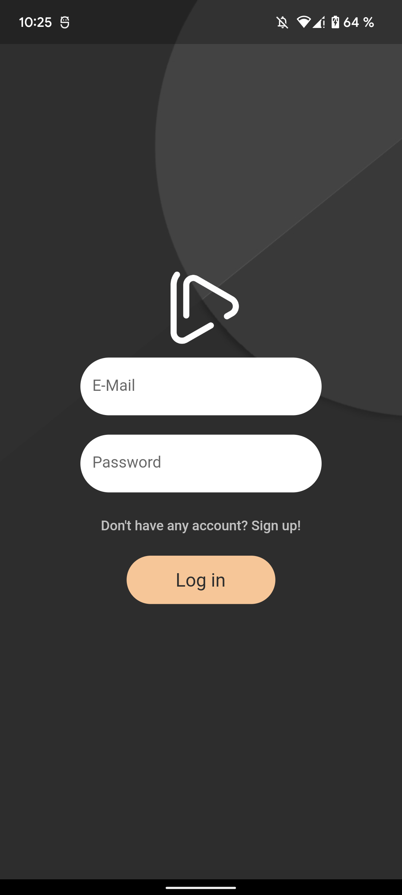
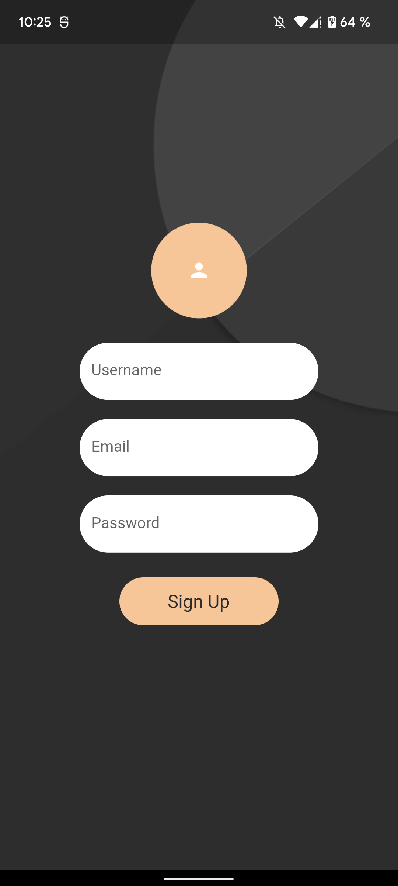
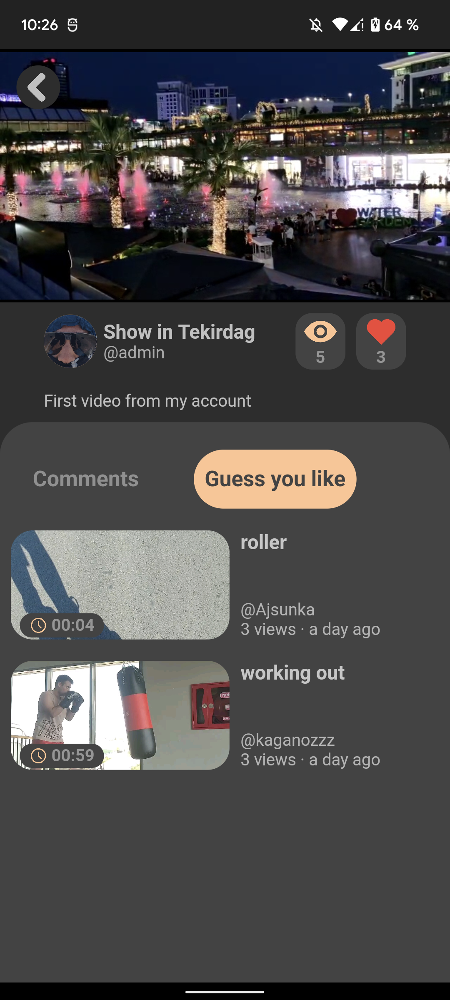
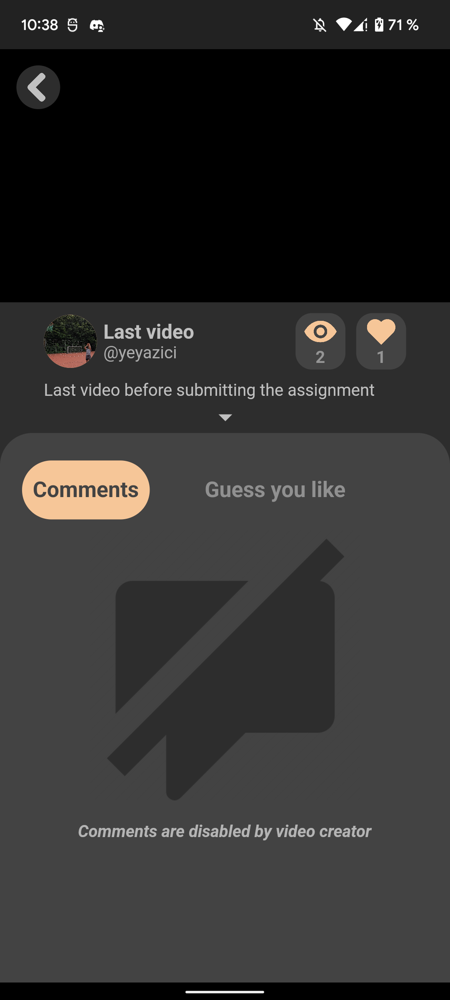
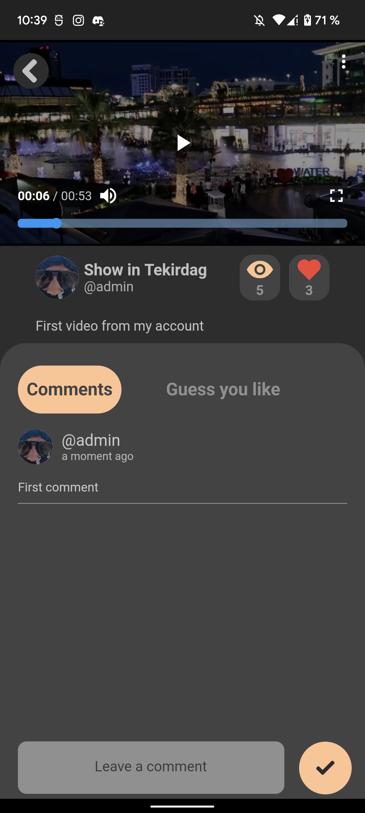
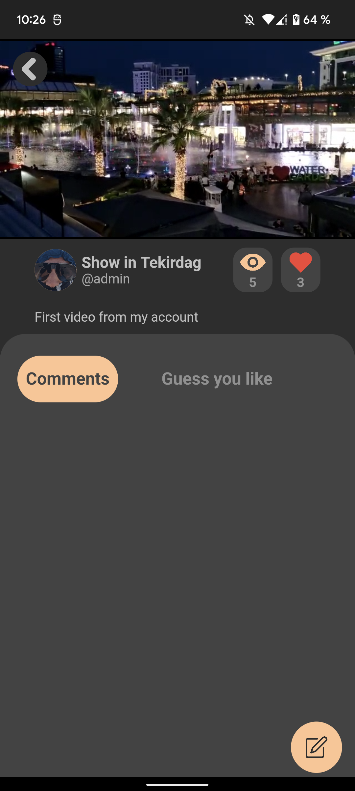
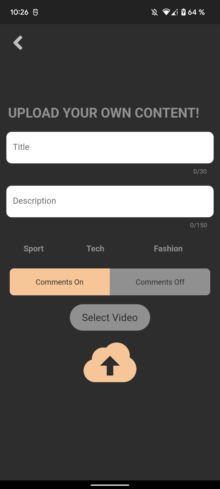
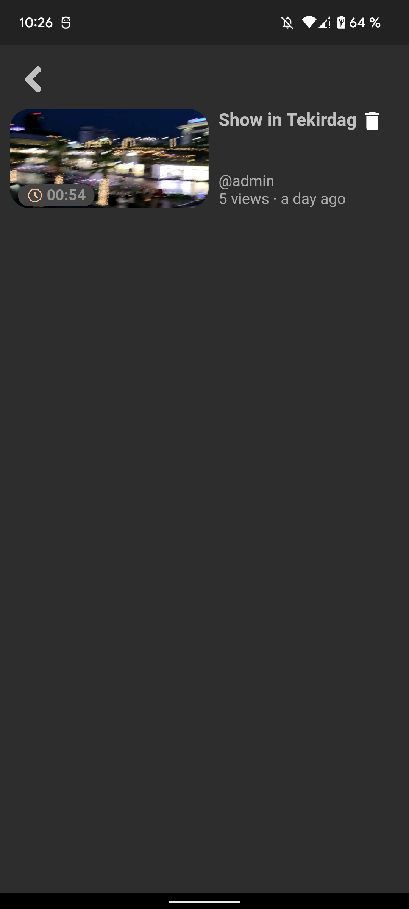
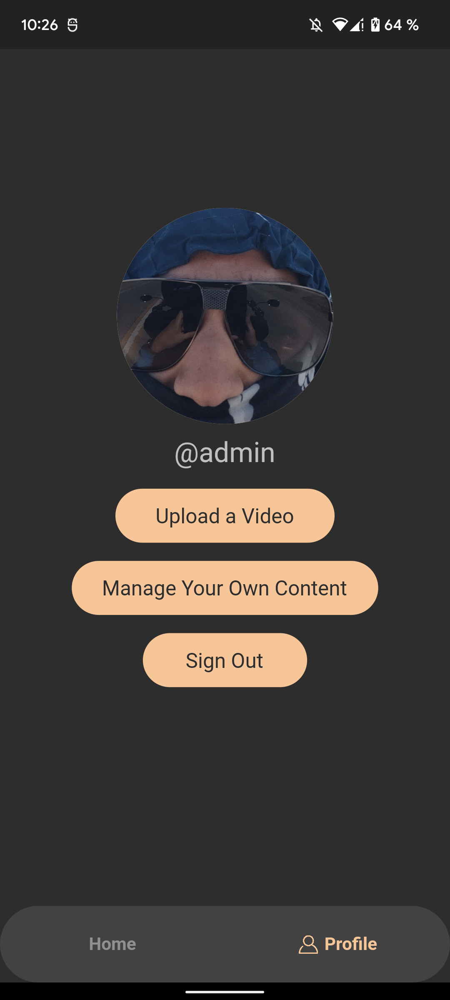

# Video Browsing Platform Application

– An Android mobile video browsing application written with Dart, Flutter  
– Users can upload/remove their own content and interact with other videos  
– Shows the data such as like, view count in real time  
– Compresses the videos while uploading  
– Uses Firebase database

## Some Screenshots

      
      
         
